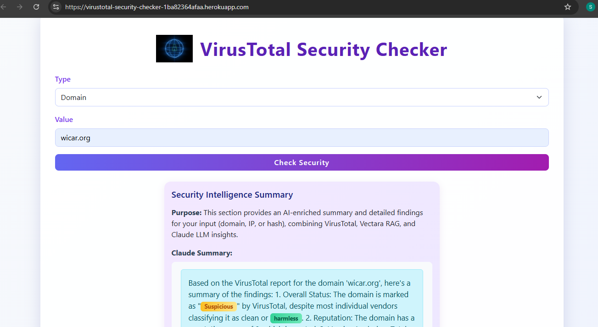
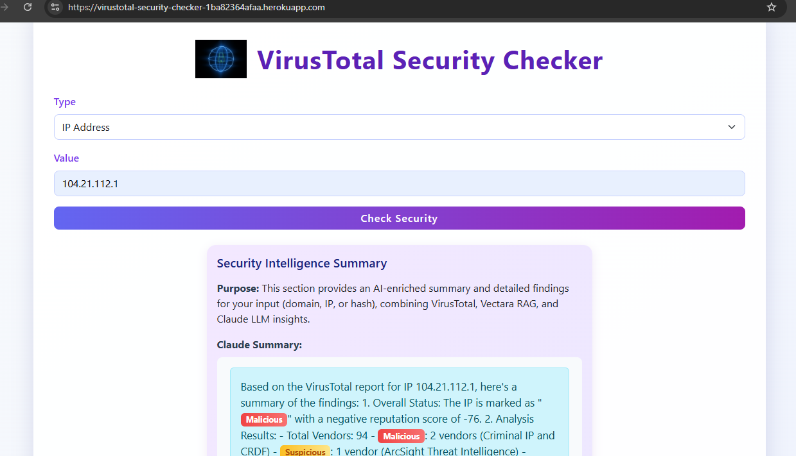

# VirusTotal Security Checker (FastAPI Web App)

A modern, full-stack web application for checking the security status of domains, IP addresses, and file hashes using the VirusTotal API v3, Vectara RAG, and Anthropic Claude LLM. Built with FastAPI, Python, HTML, CSS, and JavaScript. Now includes AI-powered enrichment, RAG search, and color-coded UI for enhanced security insights.

---


## Table of Contents

- [Features](#features)
- [Tech Stack](#tech-stack)
- [Installation](#installation)
- [Usage](#usage)
- [API Endpoints](#api-endpoints)
- [Validation & Security](#validation--security)
- [User Guidance](#user-guidance)
- [Screenshots](#screenshots)
- [Contributing](#contributing)
- [License](#license)

## User Guidance

### How to Use the VirusTotal Security Checker


1. **Select Type:** Choose whether you want to check a Domain, IP Address, or File Hash from the dropdown menu.
2. **Enter Value:** Input the domain name (e.g., example.com), IP address, or file hash (MD5, SHA1, or SHA256).
    - For IP research, you can enter either a plain IPv4 address (e.g., "192.0.2.1") or an IPv4 address with CIDR notation (e.g., "192.0.2.0/24").
3. **Check Security:** Click the "Check Security" button to analyze the input using VirusTotal, Vectara, and Claude LLM.
4. **View Results:**
    - See the overall status (Malicious, Suspicious, Harmless, Undetected) with color-coded badges.
    - Review detection statistics and a progress bar for a quick overview.
    - Filter vendor results by threat category using the provided buttons.
    - View an AI-enriched summary generated by Claude LLM, with key security terms highlighted in color.
    - See relevant RAG (Retrieval-Augmented Generation) snippets from Vectara for deeper context.
    - Click the link to view the full VirusTotal report for more details.
    - Download the JSON or plain text report for your records.
5. **Vectara RAG Search:** Use the Vectara RAG search box to ask questions or search across uploaded reports for additional intelligence.
6. **API Quota:** If available, your remaining VirusTotal API quota is displayed at the bottom of the results.

**Note:** No user data is stored or logged. For best security, always use your own API keys and deploy over HTTPS.

---


## Features

- Check domains, IP addresses, and file hashes for security status (malicious, suspicious, harmless, undetected)
- AI-powered summary using Anthropic Claude LLM, with color-coded highlights for key security terms
- Retrieval-Augmented Generation (RAG) search using Vectara: see relevant snippets and search across uploaded reports
- Upload VirusTotal reports to Vectara for future RAG/search
- Detailed vendor analysis with filtering by threat category
- Detection statistics with colored badges and progress bars
- Last analysis date and direct link to full VirusTotal report
- Downloadable JSON and plain text reports for each lookup
- User-friendly, modern UI with Bootstrap and custom styles
- API usage quota display (if available)
- Robust error handling and user feedback for all enrichment features


## Tech Stack

- **Backend:** FastAPI (Python 3.9+), Pydantic, httpx, Anthropic SDK
- **Frontend:** HTML, CSS, Vanilla JS, Bootstrap
- **API Integration:** VirusTotal API v3, Vectara API, Anthropic Claude LLM
- **Validation:** Pydantic models and custom validators
- **Deployment:** GitHub, Heroku (or any cloud platform)

---


## Installation

1. **Clone the repository:**


```bash
git clone https://github.com/Sandhya80/hello_world_fastapi.git
cd hello_world_fastapi
```

2. **Install dependencies:**


```bash
pip install -r requirements.txt
```


3. **Set up environment variables:**

    - Create a `.env` file in the project root:


```env
VT_API_KEY=your_virustotal_api_key_here
VECTARA_API_KEY=your_vectara_api_key_here
VECTARA_CUSTOMER_ID=your_vectara_customer_id   # (numeric, e.g. 1234)
VECTARA_CORPUS_ID=your_vectara_corpus_id       # (numeric, e.g. 4)
ANTHROPIC_API_KEY=your_anthropic_api_key_here
```

---


## Usage

1. **Run the application:**


```bash
uvicorn main:app --reload
```


2. **Open your browser and visit:**


- [http://localhost:8000/](http://localhost:8000/) for the local web interface
- [http://localhost:8000/docs](http://localhost:8000/docs) for local API docs (Swagger UI)
- [https://virustotal-security-checker-1ba82364afaa.herokuapp.com/](https://virustotal-security-checker-1ba82364afaa.herokuapp.com/) for the deployed web app on Heroku

---

## Deployment

### Deploy with Docker


1. **Build the Docker image:**

    ```bash
    docker build -t virustotal-security-checker .
    ```

2. **Run the container:**

    ```bash
    docker run -d -p 8000:8000 --env-file .env virustotal-security-checker
    ```

3. **Access the app:**
    - Open [http://localhost:8000/](http://localhost:8000/) in your browser.

**Note:** You may need to create a `Dockerfile` if not present. Example:

```Dockerfile
FROM python:3.10-slim
WORKDIR /app
COPY . .
RUN pip install --no-cache-dir -r requirements.txt
EXPOSE 8000
CMD ["uvicorn", "main:app", "--host", "0.0.0.0", "--port", "8000"]
```

---

### Deploy to Azure App Service (Linux)


1. **Install Azure CLI** and login:

    ```bash
    az login
    ```

2. **Create a resource group and App Service plan:**

    ```bash
    az group create --name myResourceGroup --location eastus
    az appservice plan create --name myPlan --resource-group myResourceGroup --sku B1 --is-linux
    ```

3. **Create the Web App:**

    ```bash
    az webapp create --resource-group myResourceGroup --plan myPlan --name <your-app-name> --runtime "PYTHON|3.10"
    ```

4. **Deploy your code:**

    ```bash
    az webapp deploy --resource-group myResourceGroup --name <your-app-name> --src-path .
    ```

5. **Set environment variables:**

    ```bash
    az webapp config appsettings set --resource-group myResourceGroup --name <your-app-name> --settings @.env
    ```

6. **Browse to your app:**
    - Visit `https://<your-app-name>.azurewebsites.net/`

**Note:** For production, consider using Azure Container Apps or Azure Web App for Containers for Docker-based deployment.

---

## Test Scripts


- **Claude LLM Test:**
  - `python test/test_claude.py` — Standalone test for Anthropic Claude API integration.
- **Vectara Upload/Search Test:**
  - `python test/test_vectara.py` — Standalone test for Vectara upload and search integration.

---


## API Endpoints

| Method | Endpoint                | Description                                 |
|--------|------------------------|---------------------------------------------|
| GET    | /                      | Home page (web UI)                          |
| GET    | /research_domain       | Check domain security status                |
| GET    | /research_ip           | Check IP address reputation                 |
| GET    | /research_hash         | Check file hash against VirusTotal          |
| POST   | /vectara/upload_report | Upload a text report to Vectara corpus      |
| POST   | /vectara/search        | Search the Vectara corpus for relevant docs |
| GET    | /download_report_text  | Download VirusTotal report as plain text    |
| POST   | /items/{item_id}       | (Demo) Create a new item                    |
| GET    | /items/{item_id}       | (Demo) Get item by ID                       |
| PUT    | /items/{item_id}       | (Demo) Update item                          |
| DELETE | /items/{item_id}       | (Demo) Delete item                          |

---


## Validation & Security

- All user inputs are validated using Pydantic models and regex patterns.
- API keys are stored in a `.env` file (never committed to version control).
- No user data is stored or logged.
- HTTPS is recommended for deployment.

## Screenshots





---

## Additional Features & Notes

- Claude LLM summaries and Vectara RAG results are shown in the UI with color-coded highlights for key security terms (malicious, suspicious, harmless, etc.).
- All enrichment features (VirusTotal, Vectara, Claude) are robustly error-handled and provide user feedback.
- The UI includes a security-themed GIF next to the title for a modern look (see `static/images/CyberSecurity.gif`).
- All features are designed to work together without breaking existing functionality.

---


## Contributing

Contributions are welcome! Please open issues or submit pull requests for improvements.

---


## License

This project is licensed under the MIT License.  
See the [LICENSE](LICENSE) file for details.
